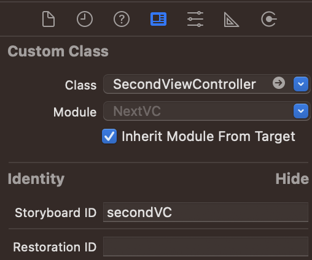
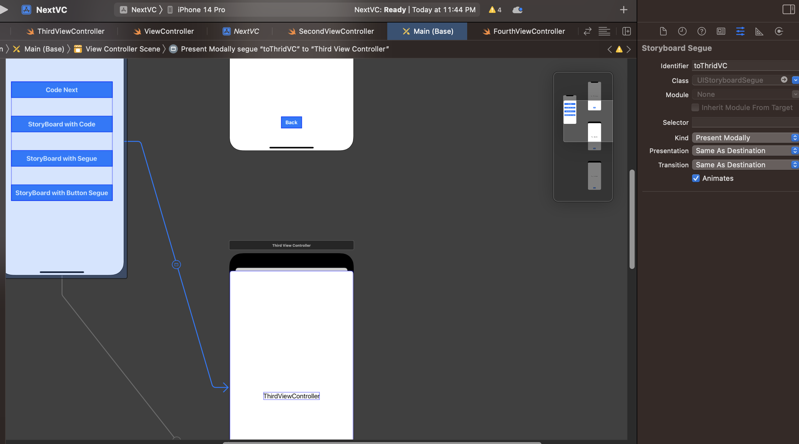

# TIL 화면전환

 ## `방법1` 코드로 화면이동

### 화면전환(현재 > 전환화면)
1. View2 생성
2. View1 버튼 Action 생성
```swift
@IBAction func modifyStockButtonTapped(_ sender: UIButton) {
        let view2 = FirstViewController()
        view2.modalPresentationStyle = .fullScreen // View2 화면방식
        present(view2, animated: true)
}
```

### 데이터 전달
```Swift
// View2

var someString: String?

mainLabel.text = someString 

// View1
@IBAction func modifyStockButtonTapped(_ sender: UIButton) {
        let view2VC = FirstViewController()
        view2.someString = "전달할 텍스트"
        view2.mainLabel.text = "전달할 텍스트" // 가능하지만 스토리보드로 만들면 사용할 수 없다. 코드로 만드는 것은 메모리에 바로 올라가지만 스토리보드로 만들면 스토리보드-코드 연결과정이 필요하다.
}
```
- text는 원래 `String?`이여서 옵셔널 바인딩 불필요

### 화면전환(전환화면 > 현재)
```swift
@objc func backButtonTapped() {
    dismiss(animated: true)
    
}
```

## `방법2` 코드로 스토리보드 객체를 생성해서 화면이동
### 화면전환(현재 > 전환화면)

1. 스토리보드에서 StoryboardID 설정(view2)
2. 화면이동 코드 입력(view1)
```swift
@IBAction func storyboardWithCodeButtonTapped(_ sender: UIButton) {
        guard let secondVC = storyboard?.instantiateViewController(withIdentifier: "secondVC") as? SecondViewController else { return }
        
        secondVC.modalPresentationStyle = .fullScreen
        
        present(secondVC, animated: true) 
    }
```
### 데이터 전달
`방법1`과 동일하지만 view2 `Label`에 직접 설정할 수 없다.
```swift
@IBAction func modifyStockButtonTapped(_ sender: UIButton) {
        guard let secondVC = storyboard?.instantiateViewController(withIdentifier: "secondVC") as? SecondViewController else { return }

        view2.someString = "전달할 텍스트"
        view2.mainLabel.text = "전달할 텍스트" // 에러발생, 연결되지 않았기 때문에(연결시점이 viewDidLoad)
}
```
### 화면전환(전환화면 > 현재)
```swift
@objc func backButtonTapped() {
    dismiss(animated: true)
    
}
```
## `방법3` 스토리보드에서의 화면 이동(간접 세그웨이)
### 화면전환(현재 > 전환화면)
1. 세그웨이 설정(identifier) `화면에서 연결`

2. view1 코드 
```swift
    @IBAction func storyboardWithSegueButtonTapped(_ sender: UIButton) {
        performSegue(withIdentifier: "toThridVC", sender: self)
    }
```
### 데이터 전달
```swift
override func prepare(for segue: UIStoryboardSegue, sender: Any?) {
    if segue.identifier == "toThridVC" {
        let thridVC = segue.destination as! ThirdViewController
        thridVC.someString = "전달 텍스트"
    }
}
```
### 화면전환(전환화면 > 현재)
```swift
@objc func backButtonTapped() {
    dismiss(animated: true)
    
}
```

## `방법4` 스토리보드에서의 화면 이동(간접 세그웨이)
### 화면전환(현재 > 전환화면)
1. 세그웨이 설정 `버튼에서 연결`

### 데이터 전달
```swift
override func prepare(for segue: UIStoryboardSegue, sender: Any?) {
    if segue.identifier == "tofourthVC" {
        let forurthVC = segue.destination as! FourthViewController
        fourthVC.someString = "전달 텍스트"
    }
}
```
### 화면전환(전환화면 > 현재)
```swift
@objc func backButtonTapped() {
    dismiss(animated: true)
    
}
```

---
`방법3`과 `방법4`의 차이
 - `방법3`: performSegue
 - `방법4`: shouldPerformSegue(조건결정)
